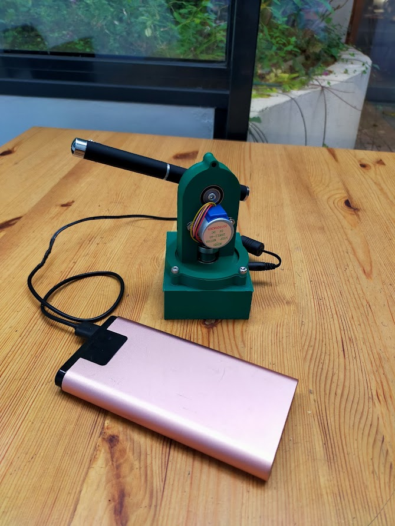

StarPointer
===========

StarPointer is a small 3D printed autonomous device that allows one to point and track sky objects (planets, shiny Messier objects, ISS) with a laser.

it's properies are :
- fully 3D printed.
- controlled by ESP8266 or ESP32
- motorized with 2 Stepper 28byj-48
- WIFI Access Point or Client
- Responsive Web interface.
- ISS tracking data auto-update.
- Dynamic tracking of objects.
- Persitence of configuration in EEPROM
- Low power (simple 5V powerpack)

