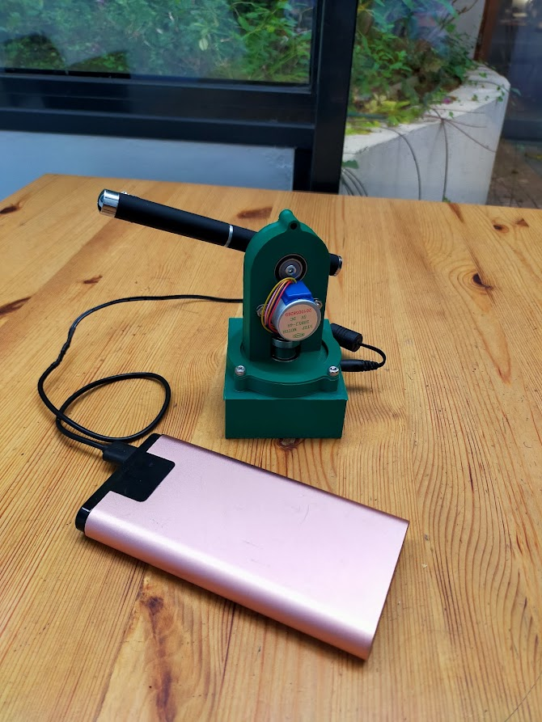

StarPointer
===========

Le StarPointer est un pointeur laser robotisé qui permet de montrer la directions des planetes, objets du ciel profond et de ISS.
Il est imprimable en 3D et controlé par un STM8266 ou STM32 via WIFI à partir d'une interface WEB dédié.

