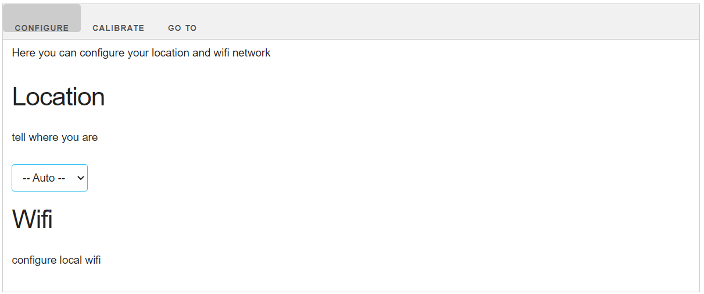
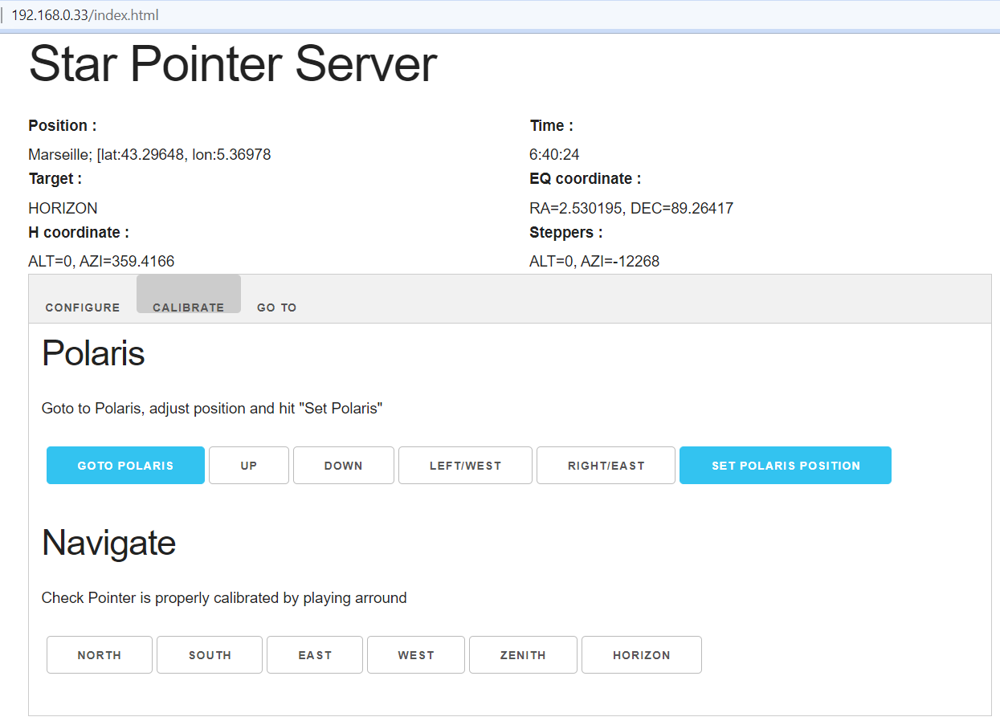
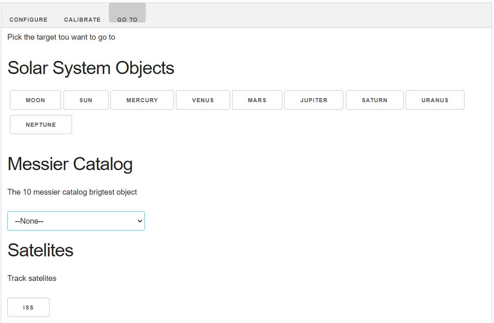

Documentation
===

StarPointer est concu pour etre calibré manuellement quelque soit son orientation.
Le seul prérequis est d'avoir l'etoile polaire en visuel.

Connexion
---
Lors de sa premiere mise sous tension le startPointer creera un Acces Point WIFI
- SSID : STAR_POINTER
- MdP  : 1234567890
- IP   : 192.168.4.1

Connectez vous-y avec votre navigateur PC ou mobile : http://192.168.4.1/

Configuration
---
StarTracker à besoin de connaitre votre position géographique et l'heure pour tous ses calculs astronomiques.

Dés votre connexion, le StarPointer recuperera l'heure de votre PC ou mobile pour se configurer.
Vous pouvez constater l'heure prise en compte sur l'interface.

Vous devrez configurer votre position géographique manuellement avec le dropdown de positions connues.

Calibration
---
Une fois l'apareil configuré, vous devez le calibrer pour qu'il sache ou est le nord celeste.

Sur l'onglet calibration
  1. appuyez sur "Goto Polaris". Le startracker se déplacera vers ce qui est polaris pour lui. initialement cette position est aléatoire.
  2. orientez le startracker pour que le pointeur laser pointe aproximativement dans la direction du nord.
  3. à l'aide des touches UP, DOWN, LEFT, RIGH, déplacez le pointeur pour qu'il pointe le plus pécisément possible sur l'étoile polaire.
  4. une fois l'alignement satisfaisant, appuyez sur "set polaris position"
Le startracker est maintenant calibré.

Vous pouvez vérifier son bon fonctionnement grace aux boutons North, south, east, west, horizon et azimuth qui déplacerons le laser vers la dircetion choisie.

Tracking
---
L'onglet goto sert à controler le startPointer une fois bien configuré.

Choisisez une target et laissez le starPointer aller à la cible puis la suivre.

Note
---
- Starpointer est contraint au dessus de l'horizon (une fois calibré). si votre cible est en dessous de l'horizon. il la suivra mais sans aller en dessous de l'horizon.

- Le calcul de la trajectoire de l'ISS dépend de données online qui doivent etre rafraichie régulierement pour etre valide. Pour se faire vous devrez connecter votre starpointer à internet avant une session d'observation.

