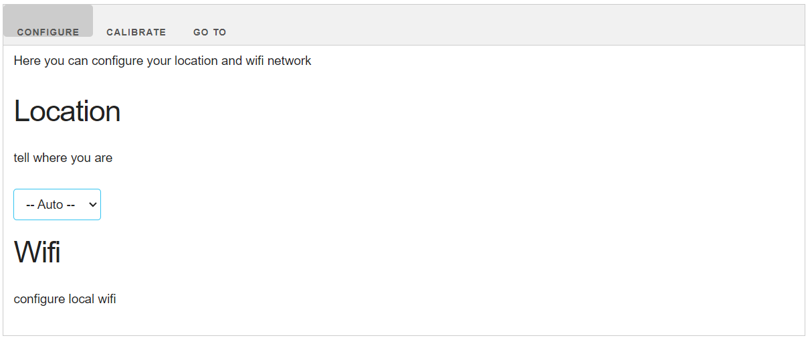
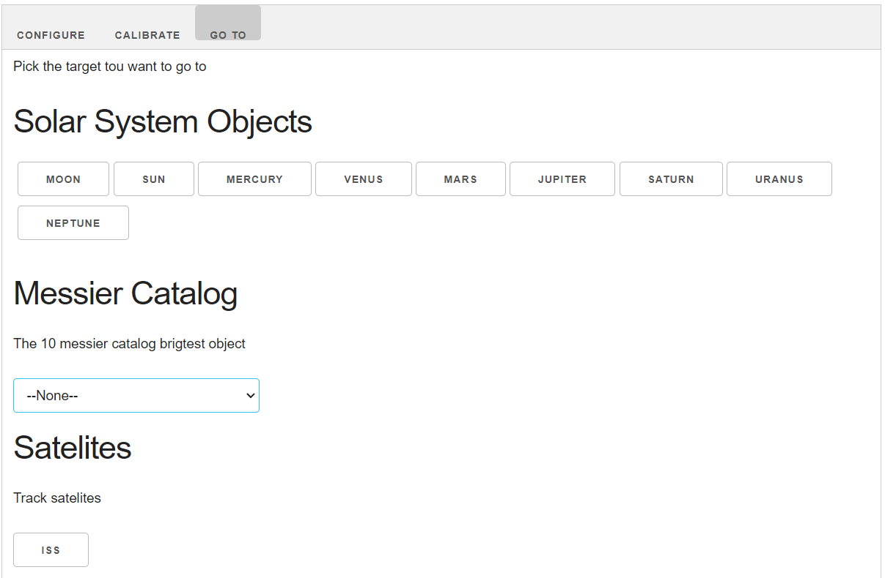

Documentation
===

Starpointer is designed to be calibrated manually whatever his position and location is.
The only requierment is to be able to see polaris from the device.

Connexion
---
StarPointer will create the flowing WIFI access point at first boot or when the local AP cannot be fount.
- SSID : STAR_POINTER
- MdP  : 1234567890
- IP   : 192.168.4.1

Connect to StarPointer by going to http://192.168.4.1/ with your favorite browser on PC or mobile.

Configuration
---
StarPonter need to know where and when it is in order to do its astonomic calculations.

On connection, StarTracker will get time and location from your browser.
You can check that time is correct in the interface.
If geo-coordinate is not found, you can set it manually from the location drowpdown or by inputing your coordinates.

Calibration
---
Once configured, you must caibrate your device so it knows where celestial north is.

1. Go to "Calibration"
2. push "Goto Polaris". StarPointer will move to where it thinks polaris is (which is random at first)
3. move the device to point more or less north.
4. using the UP, DOWN, LEFT, RIGH buttons, move the poiter so it aligns perfectly with polaris.
5. push "set polaris position" when you are done.

StarPointer is now calibrated. 

You can use the North, south, east, west, horizon and azimuth buttons to check the StarPointer is behaving as exppected.

Tracking
---
This tab is for pointing the device at some space objects.

Pick the object you want to point to and StarPointer will move to it.
Once aligned with the target StarPointer will stay in synch and will update it pointing every seconds.

Note
---
- Starpointer is constrained above horizon (once calibrated). If your target is below the horizon, it will track it while staying stuck at the horizon level.
- ISS trajectory needs some fresh online update to be accurate. Therefore StarPointer has to be connected to local Wifi network in order to refresh its reference data. It'll try to do so each time you connect to a local network.